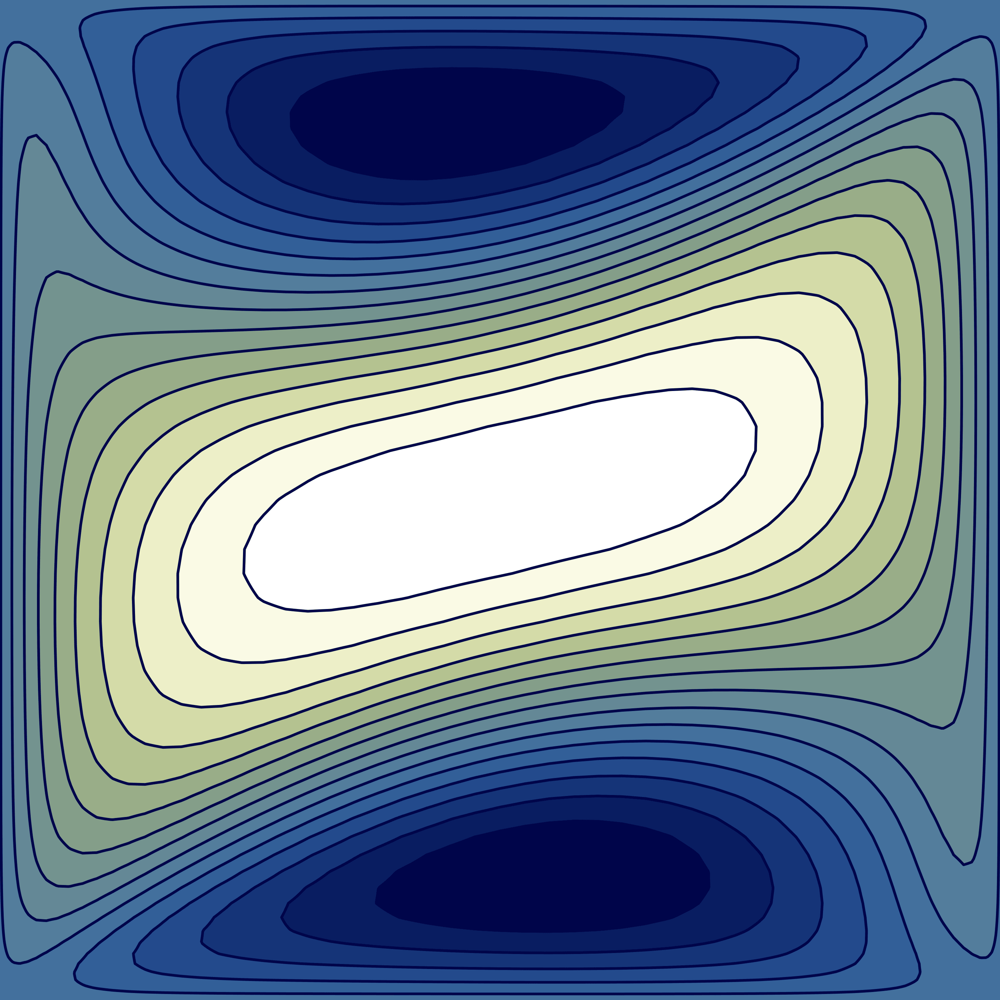

# NS2DBenchmarkSolver

Development of a Navier-Stokes benchmark solver using spectral methods.

[](https://morwald.github.io/NS2DBenchmarkSolver.jl)
[](https://github.com/morwald/NS2DBenchmarkSolver.jl/actions/workflows/CI.yml?query=branch%3Amain)
[](https://codecov.io/gh/morwald/NS2DBenchmarkSolver.jl)



This project aims at developing a set of numerical
algorithms for the study of the dynamics, linear stability and
bifurcations arising in the four-sided cavity flow. This problem has
recently been vindicated as an ideal benchmark problem for testing the
accuracy and reliability of Navier-Stokes solvers. The flows arising
in this problem exhibit all kind of fundamental bifurcations (local
and global), such as pitchfork, fold, Hopf and homoclinic, some of
them subcritical. These bifurcations seem to take place for low or
moderate Reynolds numbers, thus alleviating the spatial resolution
required to obtain accurate results.

## Installation
### For development
The julia module is not yet a registered package. To work on the development
version clone this git repository. Navigate to the root directory and start the Julia REPL. 
```bash
git clone git@github.com:morwald/NS2DBenchmarkSolver.git
cd NS2DBenchmarkSolver.jl
julia
```

Inside the REPL open the builtin package manager Pkg by pressing `]` an then run.
```julia
pkg>activate .
pkg>instantiate
```
This will activate the package and download the necessary dependencies. To run
the tests and check if everything is working: 
```julia
pkg>test
```

### Try examples 
The `examples` folder shows how one would go about using this module. The
README inside the folder contains the necessary information to run the
examples. 

### Documentation 
The development documention can be found [here](https://morwald.github.io/NS2DBenchmarkSolver.jl).
